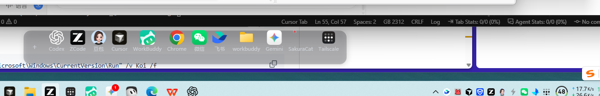
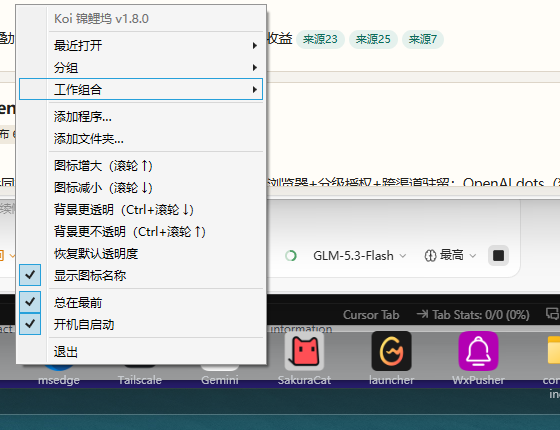
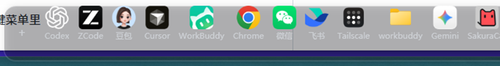
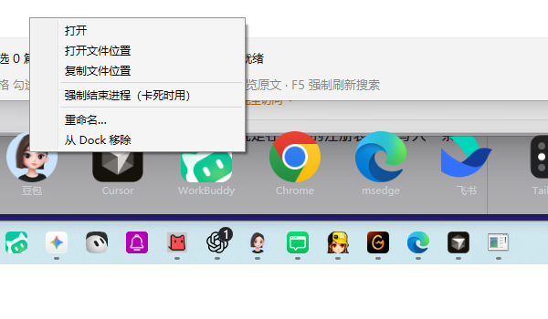

# Koi 锦鲤坞 — 让 Windows 桌面少点几下

一个带**文字名称**的 Mac 风格悬浮启动坞：所有常用应用和文件夹**一眼可辨、一下直达**。
单文件、零依赖，Windows 10/11 开箱即用。

> **为什么叫 Koi（锦鲤）？**
> 鼠标划过时图标聚拢放大的效果，学名叫「鱼眼（fisheye）」——
> 锦鲤浮于水面，指尖所至，鱼群聚拢。好记，也点题。


## 😮‍💨 背景：Windows 界面太"固化"，交互次数太多了

Windows 的日常启动路径，交互成本一直偏高：

- **任务栏图标小、没有文字**——不常用的软件得把鼠标悬停上去等气泡提示，才能确认"这是什么"
- **找个常用文件夹**，要打开资源管理器一层层点进去，窗口越开越多
- 快捷入口只能堆在桌面，图标挤在一起难辨认，还会被"自动排列"打乱
- 任务栏锁死、桌面图标不能自由拖放——想按自己的习惯排列？没有自由度

Koi 把「识别 → 定位 → 点击」压缩成**一眼 + 一下**：

| 交互场景 | Windows 原生 | 用 Koi |
| --- | --- | --- |
| 打开不常用的软件 | 悬停等提示确认 → 再点击 | 名称直接可读 → 一下点击 |
| 打开常用文件夹 | 开资源管理器 → 逐层进入 | 带名称的文件夹图标 → 一下直达 |
| 程序已在运行 | 在任务栏小图里找一圈 | 点同一个图标，直接聚焦窗口 |
| 调整入口顺序/位置 | 基本做不到 | 按住就拖，随时换、随时移 |

## ✨ 三大核心改进

1. **应用带名称，交互更友好** — 每个图标下方常显文字名称（最多两行），一眼知道是什么软件，直接点击就打开；鼠标划过还有 Mac 式鱼眼放大
2. **文件夹功能（Mac Dock 没有）** — 常用文件夹带名称常驻 Dock，点击直达，不再层层开窗口
3. **随时拖动，完全自由** — 图标按住即拖实时排序，Dock 整体拖到任意位置/任意屏幕；滚轮调大小、Ctrl+滚轮调透明度



**右键全局菜单**——添加程序/文件夹、图标大小、背景透明度、显示名称、总在最前、开机自启动：



**界面按钮**——左上角「＋」快捷添加，图标下方常显名称：



**右键图标菜单**——任务栏退役后的应急与效率入口全在这一个菜单里：

- **复制文件位置**：一键把条目的绝对路径送进剪贴板（发消息、写脚本、填配置直接粘贴），失败时会显示占用剪贴板的程序和具体错误步骤
- **强制结束进程**：程序卡死就地处理——先优雅关闭给保存机会、超时自动强杀，结束后再点一下图标即可重生，全程不用打开任务栏



## ✨ 功能一览

- **悬浮 Dock 栏**：深色半透明圆角背景 + 投影，默认停在屏幕底部（任务栏正上方），可整体拖到任意位置
- **Mac 式鱼眼放大**：鼠标划过时图标放大并凸出到 Dock 上方，相邻图标按距离联动
- **图标名称常显（核心）**：每个图标下方常显名称，最多两行、超出省略，悬停胶囊看全名——文件夹再多也能一眼定位；右键「显示图标名称」可开关
- **名称可读性优先**：项目过多放不下时横向滚动（滚到边缘自动滚 / Shift+滚轮），不缩小图标、不牺牲辨识效率
- **间距自动分布**：项目少时自动铺开利用桌面宽度，项目多时自动收紧（收到最小仍放不下才滚动），增删应用/调图标大小后自动重排，无需手动调节
- **滚轮调图标大小**：32–112px 无级缩放
- **Ctrl+滚轮调背景透明度**：25%–100%，让 Dock 融进壁纸（右键菜单也有「背景透明度」入口）
- **拖拽即添加**：`.exe` / 快捷方式 / 文件夹 / 文档，拖上去松手就完成
- **图标拖动排序**：按住图标左右拖，实时换位，顺序记住
- **右键全管理**：打开文件位置、**复制文件位置**（绝对路径进剪贴板）、**强制结束进程**（卡死时不用再开任务栏）、重命名、移除；开机自启也在右键菜单里
- **记住一切**：位置、大小、项目列表自动保存，重启后原样恢复
- 干净：不占任务栏、不出现在 Alt-Tab、单进程 ~20MB 内存
- 支持 **Microsoft Store（UWP）应用** 与**自定义 png 图标**
- 高清图标：优先取 Shell 图标缓存的 256px 版本

## 🚀 如何使用

### 第一步：启动

双击 `Koi.exe`（本仓库已附带编译好的 exe；想从源码构建见下方[「如何把 Program.cs 编译成 exe」](#-如何把-programcs-编译成-exe)）。

首次启动：Dock 出现在**屏幕底部居中、任务栏正上方**，里面有一条提示文字。
之后每次启动都会恢复上次的图标、大小和位置。

### 第二步：添加常用软件（三种方式任选）

| 方式 | 做法 |
| --- | --- |
| **＋ 按钮**（推荐） | 点 Dock 左上角的 **「＋」** → 「通过路径添加…」粘贴绝对路径（自动去引号、支持 %环境变量%）/「添加程序…」/「添加文件夹…」/「添加文件…」（文档等，点击时用默认程序打开） |
| **拖拽** | 从桌面 / 开始菜单 / 文件夹里把程序图标、快捷方式或文件夹**直接拖到 Dock 上**，松手即添加 |
| 右键菜单 | 右键 Dock 空白处 → **「添加程序…」** → 在弹窗中选择（可多选） |
| 改配置文件 | 编辑 `%APPDATA%\Koi\config.xml`，在 `<Items>` 里加一条 `<ItemCfg>`，保存后重启 Koi |

> 已在 Dock 里的应用/文件夹再次添加时会提示"已经在 Dock 里了"，不会出现重复图标
>（路径比对自动忽略大小写、正反斜杠、`.`/`..` 段和环境变量写法的差异）。

### 第三步：日常操作

| 操作 | 效果 |
| --- | --- |
| **点击图标** | 程序没在运行 → 启动；**已在运行 → 直接切到它的窗口**（不重复开新实例） |
| 鼠标悬停 | 图标放大（鱼眼效果）+ 上方显示名称标签 |
| **滚轮**（Dock 上滚动） | 放大 / 缩小所有图标（32–112px） |
| **Ctrl + 滚轮** | 调节 Dock 背景透明度（25%–100%，调到最低即近乎隐形的玻璃感） |
| **按住 Dock 空白处拖动** | 把 Dock 移到屏幕任意位置 |
| **按住图标左右拖动** | 调整图标顺序：划过哪个位置就实时落位，松手保存 |
| 右键某个图标 | 打开 / 打开文件位置 / **复制文件位置** / **强制结束进程（卡死时用）** / 重命名 / **从 Dock 移除** |
| 右键 Dock 空白处 | 添加程序 / **添加文件夹** / 图标增大减小 / 背景透明度 / **显示图标名称** / 总在最前 / **开机自启动** / 退出 |

### 推荐的初始化顺序

1. 把 5–8 个最常用的软件拖进 Dock
2. 滚轮把图标调到顺眼的大小
3. 拖到喜欢的位置（比如屏幕左侧竖放区、底部居中、或副屏）
4. 右键勾选 **「开机自启动」**——它会自动注册当前 exe 路径，
   所以上一步之前请先把 exe 放到一个不会移动的固定目录

## 📦 Microsoft Store（UWP）应用与自定义图标

Store 应用（如 Codex、终端等）装在带版本号、无权限的系统目录里，
**拖拽和「添加程序」对它们无效**，需要改配置文件：

1. 查应用 AUMID：PowerShell 运行 `Get-StartApps`，找到目标应用的 `AppID`
   （形如 `OpenAI.Codex_2p2nqsd0c76g0!App`）
2. 在 `%APPDATA%\Koi\config.xml` 的 `<Items>` 里加：

   ```xml
   <ItemCfg>
     <Name>应用名</Name>
     <Path>shell:AppsFolder\OpenAI.Codex_2p2nqsd0c76g0!App</Path>
     <Icon>C:\path\to\logo.png</Icon>
   </ItemCfg>
   ```

3. `Icon` 指向一张 png（Store 应用取不到自动图标）。
   高清 logo 的获取方式：`Get-AppxPackage -Name <包名>` 拿到 `InstallLocation`，
   从里面的 `assets\` 目录挑一张大尺寸的拷出来
4. 保存并重启 Koi

`Icon` 字段对**任何**条目都有效——普通程序也能换成自定义 png 图标。

## 🔄 开机自启动

三种方式任选其一：

**方式一：程序内一键开启（推荐）**

右键 Dock 空白处 → 勾选 **「开机自启动」**。再点一次取消勾选即关闭。
它内部做的事就是在下面的注册表位置写入一条启动项。

**方式二：手动写注册表**

```bat
reg add "HKCU\Software\Microsoft\Windows\CurrentVersion\Run" /v Koi /t REG_SZ /d "\"C:\Koi\Koi.exe\"" /f
```

移除自启：

```bat
reg delete "HKCU\Software\Microsoft\Windows\CurrentVersion\Run" /v Koi /f
```

**方式三：任务管理器管理**

开启过自启后，「任务管理器 → 启动应用」（或「设置 → 应用 → 启动」）
里会出现 Koi，可随时启用 / 禁用。

> ⚠️ **注意**：自启记录的是开启那一刻 exe 的完整路径。
> 先把 `Koi.exe` 放到固定目录再开启自启；之后挪动文件夹需重新勾选一次。

## 🔧 如何把 Program.cs 编译成 exe

仓库里的 `Koi.exe` 是已经编译好的成品，**不想编译直接用它即可**。
想自己改代码（换背景色、圆角、放大幅度、间距……）或从源码构建时，看这里。

**前提**：Windows 10 / 11 自带 .NET Framework 4.x 编译器——
**不需要安装 Visual Studio、SDK 或任何开发工具**，源码 `Program.cs` 是单文件 C# 5 语法，
约 700 行、注释齐全。

### 方式一：一键编译（推荐）

双击仓库根目录的 **`build.bat`**，它自动调用系统自带的 `csc.exe` 编译器，
在当前目录生成最新的 `Koi.exe`，完成。

> 重新编译前请先退出正在运行的 Koi（右键 Dock → 退出），否则 exe 文件被占用会写入失败。

### 方式二：手动命令行

打开 `cmd`，执行（路径按你的仓库位置调整）：

```bat
cd /d C:\Windows\Microsoft.NET\Framework64\v4.0.30319

csc -nologo -target:winexe -out:G:\workbuddy\Koi\Koi.exe ^
  -r:System.dll -r:System.Core.dll -r:System.Drawing.dll -r:Microsoft.VisualBasic.dll ^
  -r:System.Windows.Forms.dll ^
  -r:WPF\PresentationFramework.dll -r:WPF\PresentationCore.dll -r:WPF\WindowsBase.dll ^
  -r:C:\Windows\Microsoft.NET\assembly\GAC_MSIL\System.Xaml\v4.0_4.0.0.0__b77a5c561934e089\System.Xaml.dll ^
  G:\workbuddy\Koi\Program.cs
```

命令说明：

| 部分 | 作用 |
| --- | --- |
| `-target:winexe` | 生成 Windows 窗体程序（双击运行不弹黑控制台） |
| `-out:...` | 输出的 exe 路径 |
| `-r:...` | 引用的系统程序集（WPF 三件套 + 绘图 + 注册表访问） |
| `Program.cs` | 源码，单文件即全部工程 |

### 常见编译问题

- **提示 csc 不存在**：个别精简版系统缺少 .NET Framework 4.x，去微软官网装上即可
- **写不进 Koi.exe**：程序还在运行，先右键 Dock → 退出
- **提示找不到元数据文件**：必须在 `Framework64\v4.0.30319` 目录下执行（WPF 程序集的相对路径才有效），或直接用 `build.bat`

## 🏷 版本与发版

当前版本见仓库根目录 `VERSION` 文件（也会显示在右键菜单顶部）。

每次更新代码后，运行一键发版脚本，版本号自动递增并完成全套发布：

```powershell
powershell -File release.ps1           # 补丁位 +1（默认，修 bug）
powershell -File release.ps1 minor     # 次位 +1（新功能）
powershell -File release.ps1 major     # 主位 +1（大改版）
```

脚本自动完成：递增版本号 → 同步 VERSION / Program.cs → 编译 → 提交并打 tag（如 `v1.0.1`）→ 推送 → 创建 GitHub Release 并附上最新的 `Koi.exe`。

历史版本在 [Releases](https://github.com/sf00000/koi/releases) 页面下载。

## ❓ 常见问题

**Q：图标放大后有的一侧发虚？**
老程序只带 32px 图标，放大后略糊，属正常。可用 `Icon` 字段换高清 png。

**Q：全屏游戏 / 看视频时 Dock 还浮在上面？**
右键 Dock → 取消「总在最前」，需要时再勾回。

**Q：想临时藏起来？**
目前没有隐藏热键。可以把它拖到屏幕边缘只留一条，或右键退出（配置会保留）。

**Q：开机自启注册的是哪个路径？**
见上方[「开机自启动」](#-开机自启动)章节——记录的是开启那一刻 exe 的完整路径，
挪动文件夹后需重新勾选。

**Q：配置存在哪？**
`%APPDATA%\Koi\config.xml`（XmlSerializer 格式，可直接手工编辑）。
图标文件缓存目录：`%APPDATA%\Koi\icons\`。

## 🗑 卸载

1. 右键 Dock → 取消勾选「开机自启动」→ 退出
2. 删除 `Koi.exe`
3. 删除 `%APPDATA%\Koi\` 文件夹

## License

MIT
